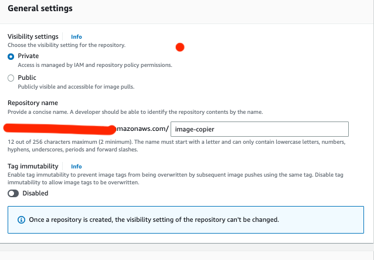
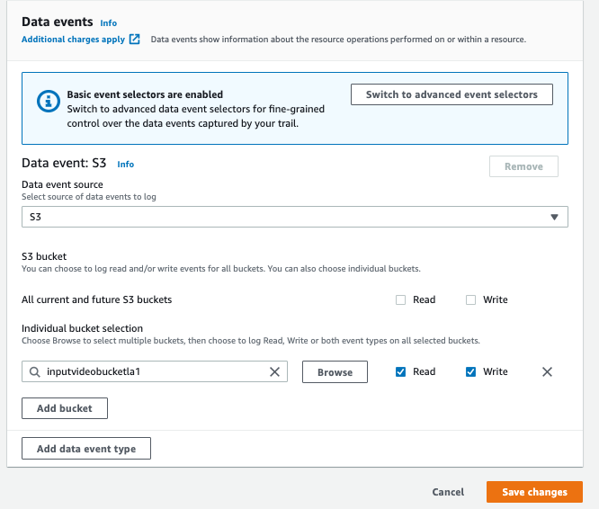

# Lab Guide
### 1. [Configure Lab Environment](Lab_Environment.md)

### 2. Docker Image
- Build Docker Image in C9
```shell
git clone https://github.com/lijontny/AWS-Batch-Lab.git
cd ./AWS-Batch-Lab/Docker
docker build -t image-copier .
```
- List the contents of the local Docker image repository.

```shell
docker images
```

- Create an ECR Repository
    - Navigate to [ECR in AWS Console](https://us-east-1.console.aws.amazon.com/ecr/repositories?region=us-east-1)
    - Click in "Create Repository"
    
    - Upload Docker image to ECR:- Select your new repository and click on the View push commands button

### 3. Configure Batch Environment with CloudFormation Script
Use [CFN Script](batch-cfn.yaml)

#### Parameters:
BatchContainerImage: ECR Repository URL <br />
BatchMaximumvCPU: 256 <br />
ContainerMemory: 1024 <br />
Environment: Dev <br />
Gpus: 0 <br />
InputVideoBucketName: Input bucket name (Example: Aptiv-input-batch-<yourname>) <br />
OutputVideoBucketName: output bucket name (Example: Aptiv-output-batch-<yourname>) <br />
SubnetPrivateIDs: Choose from the list default subnets <br />
Vcpus: 1 <br />
Vpc: Select default VPC <br />

### 4. Configure the Cloud Trail
  - Navigate to [Cloud Trail](https://us-east-1.console.aws.amazon.com/cloudtrail/home?region=us-east-1#/dashboard)
  - Create a new Trail (Don't need this step in Aptiv environment as you will have admin access to current cloudtrail)
  - Edit Data Events to log s3 data logs - 
    

### 5. Copy Images from "images" folder to input bucket

```shell
cd ./images
aws s3 cp .* s3://<input bucket>
```

### 6. Monitor Batch Dashboard
